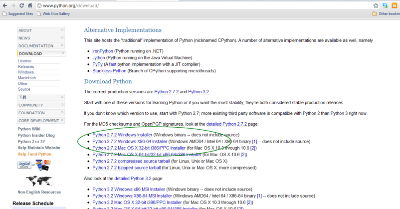

=========
Instalasi
=========

Linux
=====

Hampir semua distribusi Linux selalu menyediakan python pada sistem mereka

Mac OS
======

Sistem operasi inipun menyediakan python secara default.

Windows
=======

Pertama-tama, *download* installer Python 2 dari `situs official Python`_.

.. _situs official Python: http://www.python.org/download/

Saat saya menulis tutorial ini versi yang terakhir adalah versi 2.7.2. Saya pilih versi 2.7.2 Windows Installer. Klik saja link `Python 2.7.2 Windows Installer`_.

.. _Python 2.7.2 Windows Installer: http://www.python.org/ftp/python/2.7.2/python-2.7.2.msi

Setelah proses *download* selesai. Klik *2x* file installer, maka proses instalasi Python dimulai. Proses Instalasi Python sama saja dengan proses instalasi aplikasi Windows lainnya.
 
