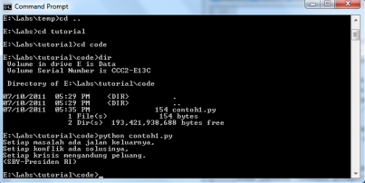

============================
Tentang Program Pertama Kita
============================

Baiklah marilah kita kembali sebentar ke program pertama kita::

    print "Setiap masalah ada jalan keluarnya,"
    print "Setiap konflik ada solusinya,"
    print "Setiap krisis mengandung peluang."
    print "(SBY-Presiden RI)"
	
dari hasil program tersebut jelas bahwa program tersebut dibuat untuk menampilkan *string*. *String* adalah kumpulan karakter yang diapit oleh tanda kutip *" "*. *Print* adalah sebuah *statement*/perintah Python untuk menampilkan *string*.

Selanjutnya mari kita ubah sedikit program pertama kita menjadi seperti berikut::

    #contoh1.py
    #program untuk menampilkan kutipan perkataan Pak SBY
	
    #berikut kutipannya
    print "Setiap masalah ada jalan keluarnya,"
    print "Setiap konflik ada solusinya,"
    print "Setiap krisis mengandung peluang."
    print "(SBY-Presiden RI)" #ini Sby lho yang bilang!
	
kemudian simpan. Kita menambahkan beberapa kalimat yang diawali oleh tanda *pound (#)*. Semua kalimat yang diawali dengan tanda *#* dianggap Python sebagai komentar dan tidak akan ditampilkan saat program dijalankan.  Mari kita jalankan program *contoh1.py* kita::

    Setiap masalah ada jalan keluarnya,
    Setiap konflik ada solusinya,
    Setiap krisis mengandung peluang.
    (SBY-Presiden RI)

Hasil/keluaran program tetap sama. 

Lalu untuk apa kita menambahkan komentar dalam program kita? Menambahkan komentar dalam program adalah kebiasaan yang baik untuk membantu kita mengingat apa maksud potongan program kita. Jika di masa datang kita akan membaca program terebut, komentar akan membantu kita mengingat maksud dan tujuan dari potongan program kita. Jadi jangan ragu-ragu untuk memberikan komentar dalam program yang Anda buat!
 
