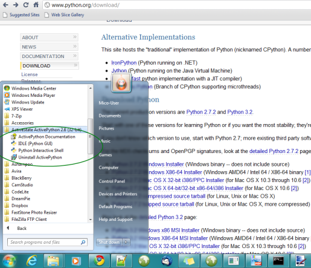
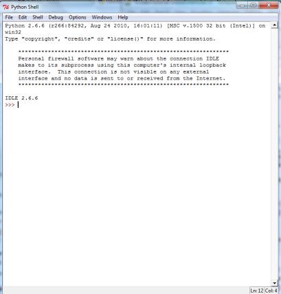

Pengantar
==========

Tutorial ini dibuat sebagai jawaban dalam milis python Indonesia mengenai ketiadaan dokumentasi python dalam bahasa Indonesia. Maka timbul beberapa usulan untuk:

* menerjemahkan tutorial python yang sudah terkenal misalnya `Byte of Python`_. 

.. _Byte of Python: http://www.swaroopch.com/notes/Python>`_.

* membuat tutorial baru dalam berbahasa Indonesia

Tutorial ini merupakan inisiatif yang kedua: membuat tutorial baru berbahasa Indonesia. 

Beberapa catatan dalam tutorial ini:

* Tutorial ini menggunakan Python 2. Saat ini versi terbaru adalah Python 3. Python 3 tidak kompatibel dengan Python 2. yang baru dari Python 3 dapat dibaca di  situs `Python`_. Namun karena mayoritas modul/packages yang ada masih menggunakan Python 2, maka saya memutuskan untuk menggunakan Python 2 sebagai dasar tutorial. Saya menggunakan Python 2.6.6.

.. _Python: http://docs.python.org/py3k/whatsnew/3.0.html

* Saya menggunakan sistem operasi Windows, secara sepesifil saya menggunakan Windows 7. Walau python memang dapat berjalan di sistem operasi lain, contoh tampilan ataupun *screenshot* yang ditampilkan di tutorial ini menampilkan tampilan di Windows. Walau dasar-dasar python yang diajarkan di tutorial ini pada dasarnya sama untuk sistem operasi lain: Unix, Linux, MacOS

* Saya sedapat mungkin tidak menggunakan instilah-instilah yang berbau teknis, namun jikalau harus menggunakan istilah-istilah komputer/teknis, saya akan menggunakan istilah-istilah komputer yang sudah dikenal, walau dalam bahasa Inggris. Misalnya saya memilih menggunakan kata *File* dibandingkan *Berkas* dengan anggapan bahwa istilah *File* lebih dikenal dibandingkan *Berkas*

Akhirnya selamat belajar Python!

Instalasi dan Memulai Python
=============================

Instalasi Python
-----------------

Tentu saja sebelum mempelajari pemrograman Python di Windows, Anda perlu melakukan instalasi Python.

Pertama-tama, *download* installer Python 2 dari `situs official Python`_.

.. _situs official Python: http://www.python.org/download/

Saat saya menulis tutorial ini versi yang terakhir adalah versi 2.7.2. Saya pilih versi 2.7.2 Windows Installer. Klik saja link `Python 2.7.2 Windows Installer`_.

.. _Python 2.7.2 Windows Installer: http://www.python.org/ftp/python/2.7.2/python-2.7.2.msi

.. image:: images/download.png

Setelah proses *download* selesai. Klik *2x* file installer, maka proses instalasi Python dimulai. Proses Instalasi Python sama saja dengan proses instalasi aplikasi Windows lainnya.

Memulai Python
---------------

Setelah proses instalasi selesai, maka Python dapat dijalankan sama juga seperti aplikasi Windows lainnya. Di Windows 7 saya:

jalankan IDLE (Python GUI). Maka jendela IDLE akan muncul.

dan kita siap untuk membuat program pertama kita. Di jendela IDLE buat jendela baru dengan meng-klik *File >> New Window* atau dengan menekan kombinasi *Ctrl+N* pada *keyboard*. Di jendela yang baru muncul tersebut baris-baris berikut::
    
	print "Setiap masalah ada jalan keluarnya,"
	print "Setiap konflik ada solusinya,"
	print "Setiap krisis mengandung peluang."
	print "(SBY-Presiden RI)"
	
kemudian simpan script di atas dengan meng-klik *File >> Save* atau dengan menekan kombinasi *Ctrl+S* maka akan muncul jendela untuk menyimpan file. Beri nama file *contoh1.py*. 

Selamat! Anda telah membuat program Python pertama Anda! Untuk menjalankan program, buka jendela *command prompt* dan pindah ke direktori tempat *contoh1.py* berada. Di *command prompt* ketikkan *python contoh1.py* maka seharusnya yang akan Anda lihat seperti berikut::

    Setiap masalah ada jalan keluarnya,
    Setiap konflik ada solusinya,
    Setiap krisis mengandung peluang.
    (SBY-Presiden RI)

.. image:: images/contoh1.png    

Rangkuman
----------

Pada bagian ini kita telah mempelajari tentang:

* instalasi python
* membuat *script* program python dalam IDLE
* menyimpan dan menjalankan *script* python

Selamat! Kini Anda boleh mengatakan kepada keluarga dan teman-teman Anda bahwa Anda adalah seoarang *Python Programmer*

Tentang Program Pertama Kita
=============================

Baiklah marilah kita kembali sebentar ke program pertama kita::

    print "Setiap masalah ada jalan keluarnya,"
    print "Setiap konflik ada solusinya,"
    print "Setiap krisis mengandung peluang."
    print "(SBY-Presiden RI)"
	
dari hasil program tersebut jelas bahwa program tersebut dibuat untuk menampilkan *string*. *String* adalah kumpulan karakter yang diapit oleh tanda kutip *" "*. *Print* adalah sebuah *statement*/perintah Python untuk menampilkan *string*.

Selanjutnya mari kita ubah sedikit program pertama kita menjadi seperti berikut::

    #contoh1.py
    #program untuk menampilkan kutipan perkataan Pak SBY
	
    #berikut kutipannya
    print "Setiap masalah ada jalan keluarnya,"
    print "Setiap konflik ada solusinya,"
    print "Setiap krisis mengandung peluang."
    print "(SBY-Presiden RI)" #ini Sby lho yang bilang!
	
kemudian simpan. Kita menambahkan beberapa kalimat yang diawali oleh tanda *pound (#)*. Semua kalimat yang diawali dengan tanda *#* dianggap Python sebagai komentar dan tidak akan ditampilkan saat program dijalankan.  Mari kita jalankan program *contoh1.py* kita::

    Setiap masalah ada jalan keluarnya,
    Setiap konflik ada solusinya,
    Setiap krisis mengandung peluang.
    (SBY-Presiden RI)

.. image:: images/contoh1.png

Hasil/keluaran program tetap sama. 

Lalu untuk apa kita menambahkan komentar dalam program kita? Menambahkan komentar dalam program adalah kebiasaan yang baik untuk membantu kita mengingat apa maksud potongan program kita. Jika di masa datang kita akan membaca program terebut, komentar akan membantu kita mengingat maksud dan tujuan dari potongan program kita. Jadi jangan ragu-ragu untuk memberikan komentar dalam program yang Anda buat!

Bilangan dan Variabel
======================

Ayam dan Bebek
---------------

Anda bekerja di pedagang ayam dan bebek, dan suatu saat Boss meminta: "Tolong hitung pendapatan kita bulan ini! SEKARANG!". Karena Anda seorang *Python Programmer* maka,

* buka laptop Anda
* jalankan IDLE
* buka jendela baru dalam IDLE untuk membuat program Python baru
* ketikkan baris-baris berikut::

    # contoh2.py
    # program untuk menghitung pendapatan per bulan
    # dari suatu pedagang ayam + bebek fiktif

    # jumlah ayam yang laku bulan ini
    ayam = 10 + 15 + 36 / 6 + 45 - 2
    print "Jumlah ayam terjual", ayam, "ekor"

    # harga jual ayam
    harga_ayam = 75000

    # jumlah bebek yang laku bulan ini
    bebek = 34 + 2 + 24 % 12 + 34 - 2
    print "Jumlah bebek terjual", bebek, "ekor"

    # harga bebek
    harga_bebek = 55000

    #pendapatan bulan ini
    pendapatan = (ayam*harga_ayam) + (bebek*harga_bebek)
    print "Pendapatan bulan ini Rp.", pendapatan
	
Kemudian jalankan program kita::

    Jumlah ayam terjual 74 ekor
    Jumlah bebek terjual 68 ekor
    Pendapatan bulan ini Rp. 9290000

Dan Anda pun menghadap Boss dengan hasil: "Pendapatan kita bulan ini: Rp. 9.290.000, Boss!"

Contoh di atas kisah rekaan namun saya ingin menyajikan beberapa konsep yang penting::

    ayam = 10 + 15 + 36 / 6 + 45 - 2
	
*ayam* adalah sebuah variabel. Apakah variabel itu? *Variabel* adalah sebuah identitas dari sebuah tempat dalam memori yang menyimpan data. Variabel *ayam* di atas menyimpan data dalam memori yang berupa data bilangan bulangan bulat. Sebelum data disimpan dalam variabel *ayam* kita melakukan beberapa operasi bilangan. Operasi bilangan ditandai dengan penggunaan *operator* bilangan / matematika. Jenis-jenis *operator matematika* yang dikenal

========  ====
Operator  Arti           
========  ====
\+        Penambahan     
\-        Pengurangan     
/         Pembagian       
%         Sisa pembagian 
\*        Perkalian      
========  ====

Sebagai catatan tambahan, Python juga mengenal jenis data bilangan selain bilangan bulat, yaitu data *real/float* (bilangan pecahan) dan bilangan *imajiner*. Sebagai referensi: `Python Language Reference, Data Model`_

.. _Python Language Reference, Data Model: http://docs.python.org/reference/datamodel.html

*Operator* yang bekerja atas bilangan *real/flot* dan *imajiner* sama dengan operator bilangan bulat. Silakan dicoba sendiri ya!

Rangkuman
----------

Melalui contoh singkat di atas kita telah belajat tentang

* variabel
* operasi matematika/bilangan

Diskon....Diskon...
====================

Kembali ke kisah fiksi di bagian sebalumnya, Anda menghadap Boss dengan hasil: "Pendapatan kita bulan ini: Rp. 9.290.000, Boss!". Boss bertanya: "Ok, apakah itu sudah memperhitungkan diskon 25% untuk pembeli ayam ke-50 dan bebek ke-50? Bulan ini kita promo, lho!". Yah, bagaimana ini si Boss? Kok baru bilang?

Tapi tenang. Sebagai seaorang *Python Programmer* saatnya menggunakan senjata baru: *while* dan *if*. Anda pun mengetikkan program berikut::

    # contoh3.py
    # program untuk menghitung pendapatan per bulan
    # dari suatu pedagang ayam + bebek fiktif
    # pembeli ayam ke-50 dan bebek ke-50 dapat diskon 25%

    # jumlah ayam yang laku bulan ini
    ayam = 10 + 15 + 36 / 6 + 45 - 2
    print "Jumlah ayam terjual", ayam, "ekor"

    # harga jual ayam
    harga_ayam = 75000

    # jumlah bebek yang laku bulan ini
    bebek = 34 + 2 + 24 % 12 + 34 - 2
    print "Jumlah bebek terjual", bebek, "ekor"

    # harga bebek
    harga_bebek = 55000

    # diskon
    diskon = 0.25

    #menghitung pendapatan
    pendapatan = 0
    ayam_ke = 1 # variabel untuk tracking ayam ke-
    bebek_ke = 1 # variabel untuk tracking bebek ke-

    # mulai perulangan ayam ke-
    while ayam_ke <= ayam:
        if ayam_ke == 50:
            pendapatan = pendapatan + (1-diskon) * harga_ayam
        else:
            pendapatan = pendapatan + harga_ayam
        ayam_ke = ayam_ke + 1 # naikkan nilai ayam_ke

    # mulai perulangan bebek ke-
    while bebek_ke <= bebek:
        if bebek_ke == 50:
            pendapatan = pendapatan + (1-diskon) * harga_bebek
        else:
            pendapatan = pendapatan + harga_bebek
        bebek_ke = bebek_ke + 1 # naikkan nilai bebek_ke    
        
    print "Pendapatan bulan ini Rp.", pendapatan

dan jalankan::

    Jumlah ayam terjual 74 ekor
    Jumlah bebek terjual 68 ekor
    Pendapatan bulan ini Rp. 9257500.0

maka Anda pun kembali ke Boss dengan jawaban: "Ok, boss, pendapatan kita bulan ini: Rp. 9.257.500".

Masih mengikuti? Ada 3 konsep yang ingin ditunjukkan dalam contoh program di atas:

while
------

*while* adalah *statement* yang mengindikasikan bahwa kita ingin mengulang sebuah bagian program selama kondisi perulangan masih terpenuhi. Contoh yang lebih sederhana dari contoh program kita::

    a = 10
    b = 1
    while b <= a:
	    print b
	    b = b + 1

yang apabila dijalankan::

    1
    2
    3
    4
    5
    6
    7
    8
    9
    10

kita mencetak nilai variabel *b* selama nilai *b* lebih kecil atau sama dengan nilai variabel *a*. 

Indentasi
---------

Bagian-bagian program dari sebuah program python ditunjukkan dengan indentasi/perataan. Jadi jangan lupa untuk menambahkan spasi pada bagian program yang diulang. Misalnya Anda lupa menambahkan spasi seperti berikut::

    a = 10
    b = 1

    while b <= a:
    print b
    b = b + 1
	
apabila dijalankan akan membangkitkan pesan kesalahan::

    File "<pyshell#14>", line 2
        print b
            ^
    IndentationError: expected an indented block

*IndentationError* kata python.

if...else...
------------

*if...else...* adalah statement yang mengindikasikan bahwa sebuah bagian program akan dijalankan apabila sebuah kondisi terpenuhi. Contoh program yang lebih sederhana::

    a = 4
    b = 5

    if a > b:
        print a, 'lebih besar dari', b
    elif a == b:
        print a, 'sama dengan', b
    else:
        print a, 'lebih kecil dari', b

Apabila dijalankan::

    4 lebih kecil dari 5
	
*elif* memungkinkan ada lebih dari sebuah kondisi.

Operator perbandingan
---------------------

Dalam menyatakan kondisi perbandingan, kita menggunakan *operator perbandingan*. Operator perbandingan yang dikenal:

========  ====
Operator  Arti           
========  ====
<         Lebih kecil dari    
<=        Lebih kecil atau sama dengan    
>         Lebih besar dari      
>=        Lebih besar atau sama dengan
==        Sama dengan
!=        Tidak sama dengan      
========  ====

Rangkuman
---------
Pada bagian ini kita telah belajar mengenai:

* *while* statement
* indentasi
* *if...else...* statement

Gerombolan: List dan Tuple
===========================

Sekarang waktunya untuk memperkenalkan para *gerombolan* dalam Python: *list* dan *tuple*. Gerombolan? Yang saya maksudkan: *list* maupun *tuple* merupakan kumpulan dari sekelompok data. Data apa saja? Data yang merupakan anggota *list* dan *tuple* dapat berupa angka atau kata. *List* maupun *tuple* bahkan dapat beranggotakan *list* maupun *tuple* yang lain.

Contoh dari *list*::

    list_angka = [1, 2, 3, 4, 5, 6, 7, 8, 9, 10]
    list_kata = ["satu", "dua", "tiga", "empat", "lima", "enam", "tujuh", "delapan", "sembilan", "sepuluh"]
    list_angka_kata = [1, "dua", 3, "empat", 5, "enam", 7, "delapan", 9, "sepuluh"]
    print list_angka
    print list_kata
    print list_angka_kata
	
maka akan menghasilkan::

    [1, 2, 3, 4, 5, 6, 7, 8, 9, 10]
    ['satu', 'dua', 'tiga', 'empat', 'lima', 'enam', 'tujuh', 'delapan', 'sembilan', 'sepuluh']
    [1, 'dua', 3, 'empat', 5, 'enam', 7, 'delapan', 9, 'sepuluh']
	
kita mendefinisikan 3 buah variabel *list* yang masing-masing berisikan 10 anggota:

* *list_angka* beranggotakan 10 buah angka
* *list_kata* beranggotakan 10 buah kata/teks/string
* *list_angka_kata* beranggotakan 10: 5 buah angka, dan 5 buah kata

Contoh dari *tuple*::

    tuple_angka = (1, 2, 3, 4, 5, 6, 7, 8, 9, 10)
    tuple_kata = ("satu", "dua", "tiga", "empat", "lima", "enam", "tujuh", "delapan", "sembilan", "sepuluh")
    tuple_angka_kata = (1, "dua", 3, "empat", 5, "enam", 7, "delapan", 9, "sepuluh")
    print tuple_angka
    print tuple_kata
    print tuple_angka_kata

yang akan menghasilkan::

    (1, 2, 3, 4, 5, 6, 7, 8, 9, 10)
    ('satu', 'dua', 'tiga', 'empat', 'lima', 'enam', 'tujuh', 'delapan', 'sembilan', 'sepuluh')
    (1, 'dua', 3, 'empat', 5, 'enam', 7, 'delapan', 9, 'sepuluh')

kita telah mendefinisikan 3 buah variabel *tuple* yang masing-masing beranggotakan 10:

* *tuple_angka* beranggotakan 10 buah angka
* *tuple_kata* beranggotakan 10 buah kata/teks/string
* *tuple_angka_kata* beranggotakan 10: 5 buah angka, dan 5 buah kata

Lalu, contoh *list* ataupun *tuple* yang berisikan *list* ataupun *tuple*::

    list_campur = [[1, "dua"], 3, "empat", (5, "enam"), 7, "delapan", 9, "sepuluh"]
    tuple_campur = (1, "dua", (3, "empat"), 5, "enam", [7, "delapan"], 9, "sepuluh")

    print list_campur
    print tuple_campur

yang akan menghasilkan::

    [[1, 'dua'], 3, 'empat', (5, 'enam'), 7, 'delapan', 9, 'sepuluh']
    (1, 'dua', (3, 'empat'), 5, 'enam', [7, 'delapan'], 9, 'sepuluh')
	
Nah, coba hitung berapa jumlah anggota dari *list_campur* dan *tuple_campur*?

**Jawab**::
    
	list_campur memiliki 8 anggota: 1 list, 3 angka, 3 kata, dan 1 tuple. 
	tuple_campur memiliki 8 anggota juga: 3 angka, 3 kata, 1 tuple, dan 1 list

Apakah jawaban kamu benar?

Kegunaan *list* dan *tuple*
---------------------------

Pertanyaan yang penting: "Lalu apa kegunaan list dan tuple?". Jawabnya: untuk membuat pembuatan progran lebih mudah. Bayangkan misalnya Boss dari contoh ayam dan bebek meminta: "Tolong dong laporkan daftar pembeli kita!", bisa saja kita membuat program seperti ini::

    #contoh5.py
    #Program untuk menampilkan daftar pelanggan

    pelanggan1 = "Bejo"
    pelanggan2 = "Karyo"
    pelanggan3 = "Tarjo"
    pelanggan4 = "Udin"
    pelanggan5 = "Asep"
    pelanggan6 = "Aminah"
    pelanggan7 = "Iyah"
    pelanggan8 = "Joni"
    pelanggan9 = "Siti"
    pelanggan10 = "Citra"

    print "Daftar pembeli:"
    print "1.", pelanggan1
    print "2.", pelanggan2
    print "3.", pelanggan3
    print "4.", pelanggan4
    print "5.", pelanggan5
    print "6.", pelanggan6
    print "7.", pelanggan7
    print "8.", pelanggan8
    print "9.", pelanggan9
    print "10.", pelanggan10

atau alternatifnya bila menggunakan *list*::

    #contoh5a.py
    #Program untuk menampilkan daftar pelanggan menggunnakan list

    pelanggan = ["Bejo", "Karyo", "Tarjo", "Udin", "Asep", "Aminah", "Iyah", "Joni", "Siti", "Citra"]

    print "Daftar pembeli:"

    cacah = 0
    while cacah < 10:
        print cacah+1, pelanggan[cacah]
        cacah = cacah + 1

yang apabila dijalankan akan memberikan hasil yang sama::

    Daftar pembeli:
    1 Bejo
    2 Karyo
    3 Tarjo
    4 Udin
    5 Asep
    6 Aminah
    7 Iyah
    8 Joni
    9 Siti
    10 Citra
	
*contoh5.py* kita perlu mengetikkan 21 baris program (tanpa menghitung komentar dan baris kosong), dibandingkan hanya 6 baris program di *contoh5a.py*. Bayangkan jika pembeli ada 100 orang!

Indeks
-------

Nah, mari kita tilik kembali bagian program dari *contoh5a.py*::

    cacah = 0
        while cacah < 10:
            print cacah+1, pelanggan[cacah]
            cacah = cacah + 1
			
kita mendefinisikan sebuah variabel *cacah* yang dalam perulangan *while...* nilainya dinaikkan satu demi satu (cacah = cacah + 1). Variabel *cacah* kemudan digunakan untuk memanggil anggota dari *list* *pelanggan* (pelanggan[cacah]). Di sini kita memanggil anggota list melalui *indeks*. Indeks merupakan bilangan yang menunjukkan urutan letak anggota. Indeks mirip seperti saat kita bersekolah dulu, masing-masing kita mendapat no urut kelas (saat kuliah no urut kelas saya 22....) sehingga saat awal pelajaran dosen memanggil "22! Mico!" maka saya menjawab: "22, hadir!". Namun perlu diingat, jika no urut kelas dimulai dari *1*,, *indeks* untuk *list* maupun *tuple* dimulai dari *0*. Sehingga jika kita memiliki list::

    pelanggan = ["Bejo", "Karyo", "Tarjo", "Udin", "Asep", "Aminah", "Iyah", "Joni", "Siti", "Citra"]
 
maka::

    pelanggan[0] = "Bejo"
    pelanggan[1] = "Karyo"
    pelanggan[2] = "Tarjo"
	
dan seterusnya.

in
---

*in* adalah operator dalam Python untuk mengetes apakah sebuah nilai merupakan anggota dari sebuah *list* atau *tuple*, misalnya::

    pelanggan = ["Bejo", "Karyo", "Tarjo", "Udin", "Asep", "Aminah", "Iyah", "Joni", "Siti", "Citra"]
    print "Udin" in pelanggan
    print "Thomas" in pelanggan
	
akan menghasilkan::

    True
    False
	
atau dengan kata lain: "Udin" adalah anggota pelanggan, sedangkan "Thomas" bukan salah satu anggota pelanggan

