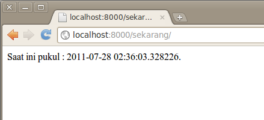

Hallo Web Dinamis
===========================

Sebuah web dinamis isisnya selalu berubah secara real time. Kita akan membuat simple aplikasi web yang menampilkan waktu sesuai dengan sistem komputer kita. 

Sebelumnya edit terlebih time zode pada setting.py dimana by defaulnya adalah TIME_ZONE = 'America/Chicago'. Ubah sesuai dengan time zone Indonesia menjadi TIME_ZONE = 'Asia/Jakarta'
Kemudian buat file views.py
::

	TIME_ZONE = 'Asia/Jakarta'

::

    import datetime
    from django.http import HttpResponse
    
    def current_datetime(request):
      now = datetime.datetime.now()
      html = "Saat ini pukul : %s." %now
      return HttpResponse(html)

Selanjutnya edit pula pada urls.py .

::

	from django.conf.urls.defaults import *
	from library.views import current_datetime

	# Uncomment the next two lines to enable the admin:
	# from django.contrib import admin
	# admin.autodiscover()

	urlpatterns = patterns('',
		# Example:
		# (r'^library/', include('library.foo.urls')),

		# Uncomment the admin/doc line below to enable admin documentation:
		# (r'^admin/doc/', include('django.contrib.admindocs.urls')),

		# Uncomment the next line to enable the admin:
		# (r'^admin/', include(admin.site.urls)),
		  (r'^sekarang/$',current_datetime),
	)

Review Kode diatas :

Pertama kita membuat file dengan nama views. Dimana pada file tersebut kita mengetikkan function yang berfungsi mendapatkan waktu sekarang .
::

	now = datetime.datetime.now()

Denagan nilai balik atau return sebuah variable dengan nama html yang isinya adalah script html.
::

	  html = "Saat ini pukul : %s." %now
	  return HttpResponse(html)

Selanjutnya agar dapat diakses via browser , maka kita harus mendaftarkan sebuah url yang akan merouting kedalam file views.py dengan function current_datetime.
::

	from library.views import current_datetime
	# admin.autodiscover()

	urlpatterns = patterns('',
		  (r'^sekarang/$',current_datetime),
	)

Perhatikan code tambahan 
::

	(r'^sekarang/$',current_datetime),

Untuk memastikan coba sekarang running aplikasinya sekarang dan buka browser dengan mengetik url http://localhost:8000/sekarang.

